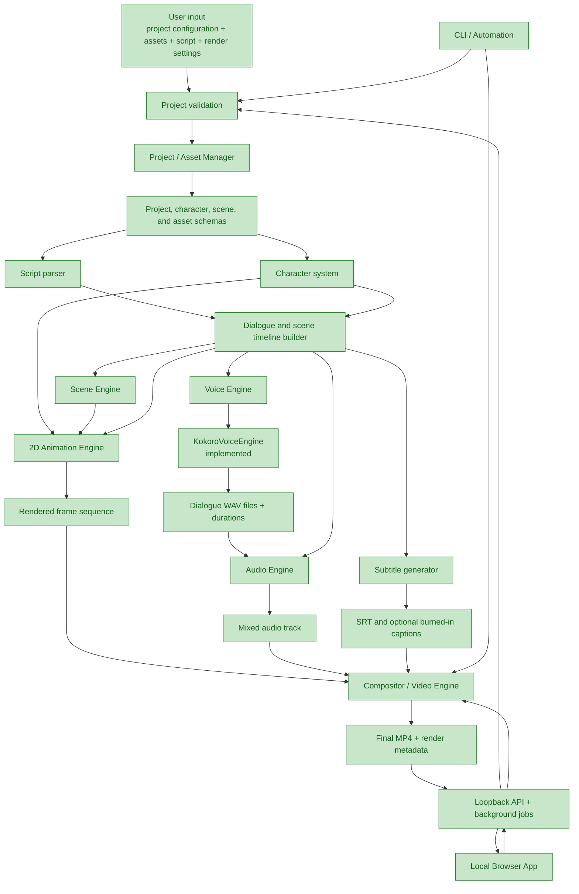
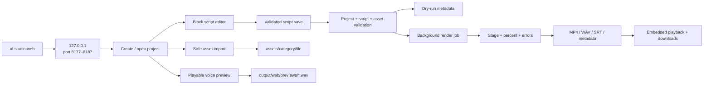
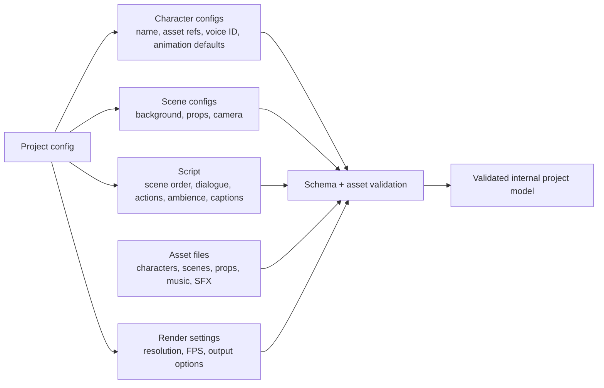
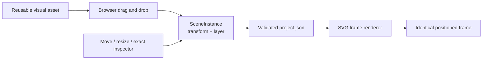
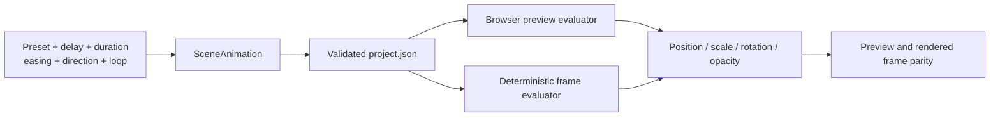
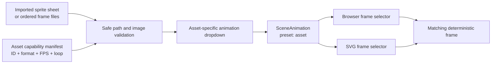
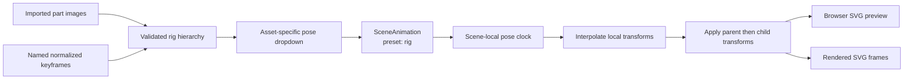
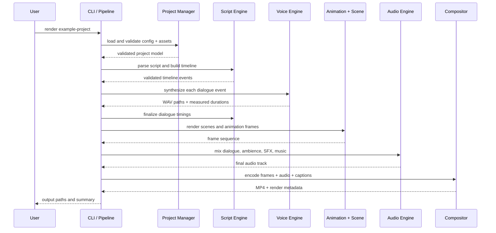
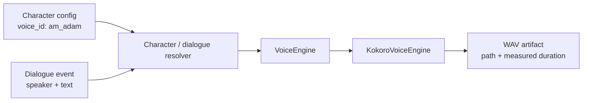
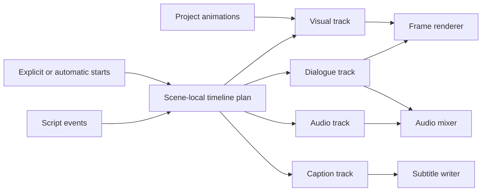

# AL Studio — Low-Level Design

> Pipeline design aligned with `GOALS.md`. Status reflects the repository on
> 2026-09-14: the deterministic render pipeline, CLI, and first local browser
> milestone are implemented and tested.

## Design Principles

- The render path is local-first and CPU-capable.
- Reusable, deterministic assets and timelines define the output.
- AI assistance is optional and must produce editable/reusable artifacts;
  it is never required for the core render path.
- TTS providers are isolated behind `VoiceEngine`.
- Each stage receives validated input, produces a named artifact, and emits
  actionable errors rather than silently continuing.

## End-to-End Pipeline



Green is implemented today. The CLI and loopback browser API both call the
same `RenderPipeline`; the web layer adds project/script persistence, guarded
asset imports, background-job progress, and local media delivery without
duplicating render-domain logic.

## Browser Interaction Flow



The HTTP layer accepts only project slugs and root-relative media paths.
Asset imports sanitize filenames, enforce category-specific extensions and a
50 MB limit, reject duplicates, and resolve every target beneath `assets/`.
Generated media is served only from `output/`.

## Inputs and Persistent Project Model

The project configuration is the source of truth. It should be versioned,
human-editable, validated before rendering, and contain references rather
than copied asset content.



### Scene instance model

Reusable visual assets are placed through scene instances rather than having
coordinates baked into the source files. Each instance owns an ID, asset
reference, X/Y position, width, height, rotation, opacity, visibility, and
z-index. The browser stage and SVG renderer both use the render coordinate
system, so saved layout values are WYSIWYG.



Characters with a matching scene instance retain that placement when dialogue
mouth animation is active. Older `prop_asset_ids` remain supported and can be
migrated into explicit instances by the Scene workspace.

### Scene animation clip model

Universal animation clips are validated children of a scene and refer to a
`SceneInstance` by ID. Both the browser preview and final SVG renderer evaluate
the same preset contract using scene-local time.



Clips may overlap on the same instance; translation and rotation are added,
scale and opacity are multiplied. The available universal presets are fade
in/out, slide in, bounce, float, pulse, rotate, and shake. Parallel visual,
dialogue, caption, and audio tracks share the same scene-local clock.

### Asset capability manifests

Visual asset entries may declare named sprite-sheet and frame-sequence
capabilities. The project loader validates manifest shape, safe asset-relative
paths, frame metadata, FPS, and unique IDs. Scene asset clips are then checked
against the selected instance's asset, preventing a character from selecting
an animation it does not own.



Universal transform presets remain available alongside declared asset motion.
The capability's frame count and FPS provide a natural duration default, while
each scene clip retains editable delay, duration, and loop settings.

### Layered and skeletal rigs

An optional rig capability turns a visual asset into a hierarchy of reusable
image layers. Each part owns a local pivot and may attach to another part;
named poses provide normalized keyframes for local translation, rotation,
scale, and opacity. Project validation rejects unsafe files, missing parents,
cycles, unknown keyframed parts, duplicate IDs, and invalid time ranges.



Rig poses affect pixels inside an instance while universal presets continue to
affect the complete instance. This separation permits a waving arm and a
whole-character slide or bounce to run together without browser-only state.

### Proposed responsibility boundaries

| Component | Owns | Must not own |
| --- | --- | --- |
| Project/Asset Manager | Loading project files, resolving asset paths, missing-asset errors | Rendering logic or TTS-provider details |
| Character System | Stable character identity, visual references, voice ID, animation defaults | Kokoro pipeline initialization |
| Script Engine | Script parsing, speaker/action validation, timeline events | Pixel/frame rendering |
| Voice Engine | Converting one text segment to audio through a provider | Character lookup or scene timing policy |
| Scene/Animation Engines | Visual state and deterministic frames | Audio mixing or MP4 encoding |
| Audio Engine | Dialogue alignment, ambience/SFX/music mixing | Character rendering |
| Compositor/Video Engine | Combining frames, audio, captions, and FFmpeg output | Project semantics |
| CLI/Pipeline | Stage orchestration, user-facing progress, output locations | Duplicated domain logic |

## Render-Stage Contract

Each stage writes only inside a render-specific output directory. The
pipeline records stage inputs, produced paths, duration/timing metadata,
and failures so a render can be inspected and retried.



## Voice Engine Design

Current implementation:

```text
app/audio/
├── voice.py     VoiceEngine abstract interface
├── kokoro.py    KokoroVoiceEngine implementation
└── __init__.py
```

`VoiceEngine.synthesize(text, voice, output_path) -> Path` is the
provider-neutral boundary. `KokoroVoiceEngine` currently creates a CPU
`KPipeline`, writes mono PCM-16 WAV output at 24 kHz, creates the parent
output directory, and returns the output path.

The voice boundary rejects empty or non-string text/voice IDs and invalid
output paths before calling a provider. The Kokoro adapter requires a `.wav`
path and wraps provider or audio-writing failures in `VoiceSynthesisError`.
An injected pipeline is supported for fast unit tests; production continues
to construct the real Kokoro pipeline by default.

The next character layer should hold a stable logical `voice_id` value,
such as `am_adam`. The character system passes that value to `VoiceEngine`;
it must not import or configure `KokoroVoiceEngine` directly.



## Timeline Model

The timeline is the common contract between dialogue, animation, audio,
captions, and composition. Every event should have a deterministic start
time, duration, scene identifier, and payload specific to its event type.

```text
TimelineEvent
  id
  type: animation | dialogue | action | ambience | sound_effect | caption
  track: visual | dialogue | caption | audio
  scene_id
  start_seconds
  duration_seconds
  scene_start_seconds
  scene_duration_seconds
  payload
```

For dialogue, the payload should include the speaker ID, text, generated
WAV path, and caption text. Generated WAV duration becomes the dialogue
duration; the same time interval drives mouth animation, audio placement,
and subtitle timing.

The builder first resolves scene-local scheduling. An explicit
`start_seconds` places an event independently; an omitted start advances from
the furthest endpoint for backwards-compatible sequential scripts. It then
adds project animation clips to the visual track, calculates the scene window,
and offsets the next scene. The renderer selects the scene window separately
from the active dialogue, so mouth animation and visual clips can overlap.



## Output Layout

The final path names may evolve, but the pipeline should keep all
intermediate artifacts grouped under one render ID.

```text
output/
└── <project-name>-<render-id>/
    ├── metadata.json
    ├── validation.json
    ├── timeline.json
    ├── dialogue/
    │   └── <event-id>.wav
    ├── frames/
    │   └── <frame-number>.png
    ├── audio/
    │   └── mix.wav
    ├── subtitles/
    │   └── captions.srt
    └── final/
        └── <project-name>.mp4
```

## Planned Delivery Slices

1. **Minimal vertical slice:** one static scene, one character, generated
   dialogue WAV, timed mouth animation, subtitles, and MP4 rendering.
2. **Multi-scene production:** add multiple characters, props, transitions,
   ambience, sound effects, and music mixing.
3. **Release hardening:** CLI, dry-run/verbose modes, reproducibility,
   logging, full test layers, documentation, CPU benchmark, and licensing
   review.
4. **Optional AI helpers:** add only after the deterministic pipeline works
   independently.

## Completion Checks

The first release is ready when the reference example can be rendered from a
clean local setup with one documented command, produces an MP4 containing
video and synchronized audio, provides subtitles, preserves distinct
character voices across scenes, and passes unit, integration, and
end-to-end tests.
