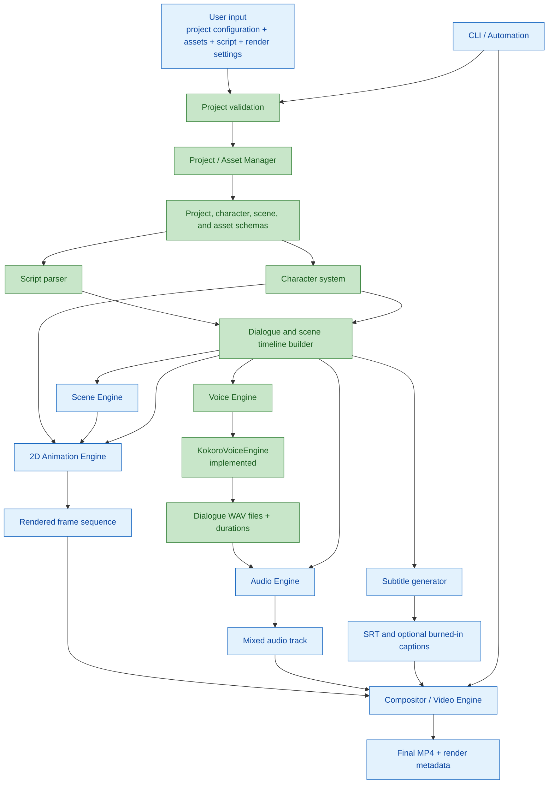
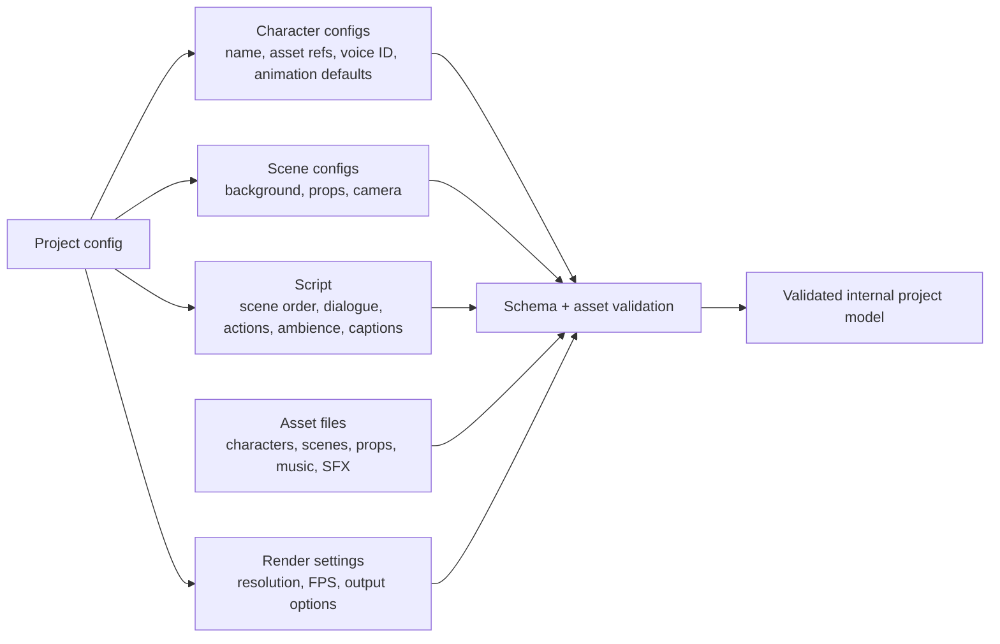
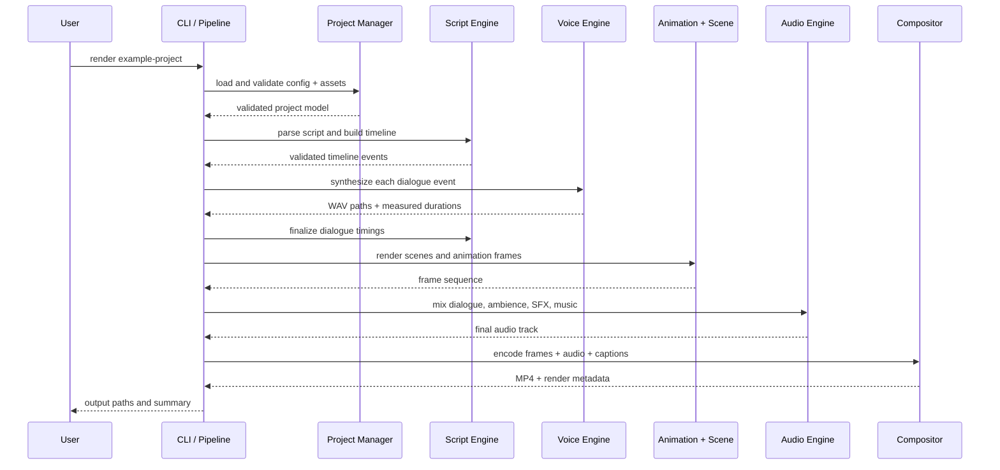
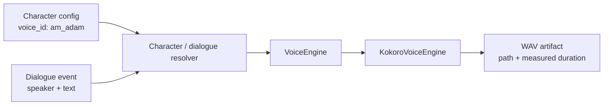

# AL Studio — Low-Level Design

> Pipeline design aligned with `GOALs.md`. Status reflects the repository on
> 2026-09-13: the voice engine, project/asset model, script parser, and
> dialogue timeline are implemented; the visual and final-output pipeline
> components described below are planned.

## Design Principles

- The render path is local-first and CPU-capable.
- Reusable, deterministic assets and timelines define the output.
- AI assistance is optional and must produce editable/reusable artifacts;
  it is never required for the core render path.
- TTS providers are isolated behind `VoiceEngine`.
- Each stage receives validated input, produces a named artifact, and emits
  actionable errors rather than silently continuing.

## End-to-End Pipeline



Green is implemented today; blue is planned. The `VoiceEngine` interface
and its Kokoro adapter exist under `app/audio/`. `ProjectConfig`,
`ProjectAssetManager`, `CharacterConfig`, and `SceneConfig` provide the
validated project/asset boundary. The script parser and dialogue timeline now
synthesize WAV files through `VoiceEngine` and use their measured durations;
visual and final-output orchestration are still pending.

## Inputs and Persistent Project Model

The project configuration is the source of truth. It should be versioned,
human-editable, validated before rendering, and contain references rather
than copied asset content.



### Proposed responsibility boundaries

| Component | Owns | Must not own |
| --- | --- | --- |
| Project/Asset Manager | Loading project files, resolving asset paths, missing-asset errors | Rendering logic or TTS-provider details |
| Character System | Stable character identity, visual references, voice ID, animation defaults | Kokoro pipeline initialization |
| Script Engine | Script parsing, speaker/action validation, timeline events | Pixel/frame rendering |
| Voice Engine | Converting one text segment to audio through a provider | Character lookup or scene timing policy |
| Scene/Animation Engines | Visual state and deterministic frames | Audio mixing or MP4 encoding |
| Audio Engine | Dialogue alignment, ambience/SFX/music mixing | Character rendering |
| Compositor/Video Engine | Combining frames, audio, captions, and FFmpeg output | Project semantics |
| CLI/Pipeline | Stage orchestration, user-facing progress, output locations | Duplicated domain logic |

## Render-Stage Contract

Each stage writes only inside a render-specific output directory. The
pipeline records stage inputs, produced paths, duration/timing metadata,
and failures so a render can be inspected and retried.



## Voice Engine Design

Current implementation:

```text
app/audio/
├── voice.py     VoiceEngine abstract interface
├── kokoro.py    KokoroVoiceEngine implementation
└── __init__.py
```

`VoiceEngine.synthesize(text, voice, output_path) -> Path` is the
provider-neutral boundary. `KokoroVoiceEngine` currently creates a CPU
`KPipeline`, writes mono PCM-16 WAV output at 24 kHz, creates the parent
output directory, and returns the output path.

The voice boundary rejects empty or non-string text/voice IDs and invalid
output paths before calling a provider. The Kokoro adapter requires a `.wav`
path and wraps provider or audio-writing failures in `VoiceSynthesisError`.
An injected pipeline is supported for fast unit tests; production continues
to construct the real Kokoro pipeline by default.

The next character layer should hold a stable logical `voice_id` value,
such as `am_adam`. The character system passes that value to `VoiceEngine`;
it must not import or configure `KokoroVoiceEngine` directly.



## Timeline Model

The timeline is the common contract between dialogue, animation, audio,
captions, and composition. Every event should have a deterministic start
time, duration, scene identifier, and payload specific to its event type.

```text
TimelineEvent
  id
  type: dialogue | action | scene_change | ambience | sound_effect | caption
  scene_id
  start_seconds
  duration_seconds
  payload
```

For dialogue, the payload should include the speaker ID, text, generated
WAV path, and caption text. Generated WAV duration becomes the dialogue
duration; the same time interval drives mouth animation, audio placement,
and subtitle timing.

## Output Layout

The final path names may evolve, but the pipeline should keep all
intermediate artifacts grouped under one render ID.

```text
output/
└── <project-name>-<render-id>/
    ├── metadata.json
    ├── validation.json
    ├── timeline.json
    ├── dialogue/
    │   └── <event-id>.wav
    ├── frames/
    │   └── <frame-number>.png
    ├── audio/
    │   └── mix.wav
    ├── subtitles/
    │   └── captions.srt
    └── final/
        └── <project-name>.mp4
```

## Planned Delivery Slices

1. **Minimal vertical slice:** one static scene, one character, generated
   dialogue WAV, timed mouth animation, subtitles, and MP4 rendering.
2. **Multi-scene production:** add multiple characters, props, transitions,
   ambience, sound effects, and music mixing.
3. **Release hardening:** CLI, dry-run/verbose modes, reproducibility,
   logging, full test layers, documentation, CPU benchmark, and licensing
   review.
4. **Optional AI helpers:** add only after the deterministic pipeline works
   independently.

## Completion Checks

The first release is ready when the reference example can be rendered from a
clean local setup with one documented command, produces an MP4 containing
video and synchronized audio, provides subtitles, preserves distinct
character voices across scenes, and passes unit, integration, and
end-to-end tests.
