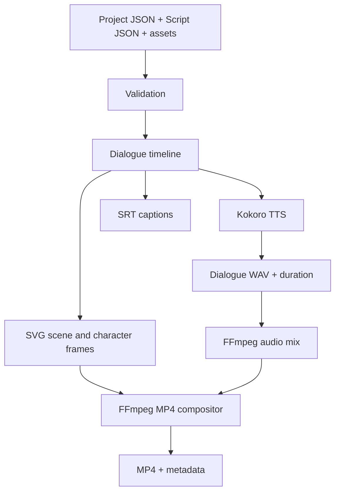

# AL Studio

AL Studio is a local-first, script-driven 2D animation studio. It renders reusable character and scene assets plus dialogue scripts into SVG frames, WAV audio, SRT captions, and an H.264/AAC MP4.

## Pipeline



See [LLD.md](LLD.md) for the detailed design.

## Prerequisites

- Linux, Python 3.12, FFmpeg, and eSpeak NG.
- Internet access for Kokoro's first model download; later synthesis uses the local cache.

Ubuntu/Linux Mint setup:

```bash
sudo apt update
sudo apt install ffmpeg espeak-ng python3.12 python3.12-venv
```

## Installation

Clone the repository and enter it:

```bash
git clone <your-fork-or-repository-url> al-studio
cd al-studio
```

Create an isolated Python environment. AL Studio currently supports Python
3.12 only because of its tested Kokoro dependency combination:

```bash
python3.12 -m venv .venv
source .venv/bin/activate
python -m pip install --upgrade pip
pip install -e .
```

The editable install means source edits are picked up immediately. Confirm the
command and system dependencies are available:

```bash
al-studio --help
ffmpeg -version
espeak-ng --version
```

On the first real speech synthesis, Kokoro downloads its model files to the
local Hugging Face cache. Keep the terminal connected to the internet for that
first run; future runs normally use the cache.

## Use the Browser App

From the repository root, with the virtual environment active, run:

```bash
al-studio-web
```

AL Studio opens in your default browser at `http://127.0.0.1:8177`. It binds
only to the loopback interface, so the workspace is not exposed to other
computers on your network. If 8177 is occupied, the launcher tries ports
8178–8187 in order and prints the selected address.

Useful launcher options:

```bash
al-studio-web --no-browser       # start without opening a browser tab
al-studio-web --port 9123        # require a specific local port
```

Keep the terminal running while you use the app; press `Ctrl+C` there to stop
it. Always launch from the repository root because that directory contains
the app's local `projects/`, `assets/`, and `output/` workspace.

### Create and edit a story

1. Open **Projects**, choose **New project**, enter a title, and select
   **Create project**. The app creates a valid starter project with an opening
   scene, a narrator using `af_heart`, and a neutral SVG background.
2. In **Script**, edit the dialogue text, speaker, or caption directly in its
   block. Add dialogue, timed action, or timed caption blocks with the buttons
   below the scene. Use the arrow buttons to reorder blocks and `×` to remove
   one, then select **Save script**.
3. In **Voice lab**, enter a Kokoro voice ID and a short line, then select
   **Generate preview**. The resulting WAV appears in the page's audio player
   and can also be downloaded.
4. In **Render**, select **Validate project**. Once preflight succeeds, use
   **Run dry-run** to verify the planned work without TTS or final media, or
   **Render MP4** for the complete pipeline.
5. The Render desk displays the current pipeline stage, percentage, errors,
   and finished artifacts. MP4 and WAV files play in the page; MP4, WAV, SRT,
   and metadata files have open/download links.

### Import local assets

Open **Assets**, select the asset category, choose a supported file, and
select **Import asset**. Visual categories accept SVG, PNG, and WebP; audio
categories accept WAV, MP3, and OGG. Imports are limited to 50 MB, duplicate
names are rejected, and the server confines every destination to a category
inside `assets/`.

An import adds the file to the reusable library; it does not silently rewrite
an existing project's asset references. To replace or expand the starter
project's scene/character configuration, edit its `project.json` using the
format documented below, then reopen the project in the browser.

Browser renders are stored under
`output/web/<project-slug>/<render-id>/`. Voice previews are stored under
`output/web/previews/`. Both directories are Git-ignored.

If the page cannot connect, confirm the launcher terminal is still running
and use the exact address it printed. If the requested port is occupied,
omit `--port` to enable fallback selection or choose another unused port.

## Where Your Files Go

The repository deliberately keeps private creative work out of Git:

```text
assets/                 Your local reusable images and audio (Git-ignored)
├── characters/
├── scenes/
├── props/
├── audio/
└── music/
projects/               Your local project and script JSON files (Git-ignored)
└── my-story/
    ├── project.json
    └── script.json
output/                 Generated media and render metadata (Git-ignored)
└── my-story/
```

`assets/`, `projects/`, and `output/` contain tracked `.gitkeep` placeholders
only. Put your actual images, audio, stories, and renders in the directories
above; they remain local unless you intentionally change the ignore rules.

## Create Your First Project

Create local directories for a project and its reusable visual assets:

```bash
mkdir -p assets/characters assets/scenes assets/props
mkdir -p projects/my-story
```

Add these three visual files:

```text
assets/characters/alex.svg
assets/scenes/room.svg
assets/props/plant.svg
```

The first renderer accepts `.svg`, `.png`, and `.webp` visual assets. SVG is a
good starting point because it stays crisp at any render size. Use a character
image that faces right; AL Studio can mirror it for left-facing states later.

Create `projects/my-story/project.json`:

```json
{
  "schema_version": 1,
  "name": "my-story",
  "assets": [
    {"id": "alex-visual", "kind": "character", "path": "characters/alex.svg"},
    {"id": "room", "kind": "scene", "path": "scenes/room.svg"},
    {"id": "plant", "kind": "prop", "path": "props/plant.svg"}
  ],
  "characters": [
    {
      "name": "Alex",
      "voice_id": "am_adam",
      "visual_asset_id": "alex-visual",
      "animation": {"idle_motion": true, "mouth_style": "simple"}
    }
  ],
  "scenes": [
    {
      "id": "room",
      "background_asset_id": "room",
      "prop_asset_ids": ["plant"],
      "camera": {"x": 0, "y": 0, "zoom": 1.0}
    }
  ],
  "render": {"width": 1280, "height": 720, "fps": 24}
}
```

Asset `path` values are always relative to `assets/`; paths cannot be absolute
or leave that directory. Valid asset kinds are `character`, `scene`, `prop`,
`audio`, and `music`.

Validate the project and inspect what AL Studio resolves before writing a
script:

```bash
al-studio validate projects/my-story/project.json
al-studio inspect-assets projects/my-story/project.json
```

## Write a Story Script

Create `projects/my-story/script.json`:

```json
{
  "schema_version": 1,
  "scenes": [
    {
      "scene_id": "room",
      "events": [
        {
          "type": "dialogue",
          "speaker": "Alex",
          "text": "Hello. This is my first story made with AL Studio.",
          "caption": "Hello. This is my first story made with AL Studio."
        },
        {"type": "action", "name": "wave", "duration_seconds": 0.8},
        {"type": "caption", "text": "The End", "duration_seconds": 1.5}
      ]
    }
  ]
}
```

`scene_id` must match a scene from `project.json`; `speaker` must match a
character name. Dialogue duration comes from the generated voice audio. The
other supported event types—`action`, `ambience`, `sound_effect`, and
`caption`—need a positive `duration_seconds`.

Actions are currently timeline markers rather than pose changes, and ambience
or sound-effect events are parsed but not yet mixed from source files. See
[app/script/FORMAT.md](app/script/FORMAT.md) for the formal format reference.

## Render Your Story

First run a dry run. It validates assets and project/script data without
calling TTS or producing media:

```bash
al-studio render \
  projects/my-story/project.json \
  projects/my-story/script.json \
  --output output/my-story-plan \
  --dry-run --verbose
```

Then render the complete story:

```bash
al-studio render \
  projects/my-story/project.json \
  projects/my-story/script.json \
  --output output/my-story \
  --verbose
```

`--verbose` prints the current stage order. A short CPU render can take longer
than the story duration because it includes voice synthesis and FFmpeg video
encoding.

## CLI

```text
al-studio validate PROJECT [--assets ASSET_ROOT]
al-studio inspect-assets PROJECT [--assets ASSET_ROOT]
al-studio voice-preview --text TEXT --voice VOICE_ID [--output FILE.wav]
al-studio render PROJECT SCRIPT [--assets ASSET_ROOT] [--output DIRECTORY]
                  [--dry-run] [--verbose]
```

Use `--assets` only when your reusable asset root is somewhere other than the
repository's `assets/` directory. Preview a voice before assigning it to a
character:

```bash
al-studio voice-preview \
  --voice am_adam \
  --text "Hello from AL Studio." \
  --output output/alex-preview.wav
```

## Find the Rendered Output

The example render above produces:

```text
output/my-story/
├── metadata.json                Render completion or dry-run state
├── dialogue/                    Generated character WAV files
├── frames/                      Deterministic SVG animation frames
├── audio/mix.wav                Final mixed dialogue audio
├── subtitles/captions.srt       Time-aligned subtitles
└── final/my-story.mp4           Final H.264/AAC video
```

Open `final/my-story.mp4` in your normal media player. Keep the whole output
directory if a render fails: `metadata.json`, the dialogue WAVs, frames, and
mix identify which stage completed. Fix the reported project, script, asset,
or TTS issue and rerun the same command.

## Tests and Development

Run tests with:

```bash
.venv/bin/python -m pytest -q
```

For source checks in a development environment, install `ruff` and `mypy`,
then run:

```bash
ruff format --check app tests
ruff check app tests
mypy app
```

## Current Limitations

This is an early deterministic vertical slice. Actions are timed but do not yet change poses; ambience and sound-effect events are parsed but not mixed from source assets; captions are SRT files rather than burned into MP4 video.
