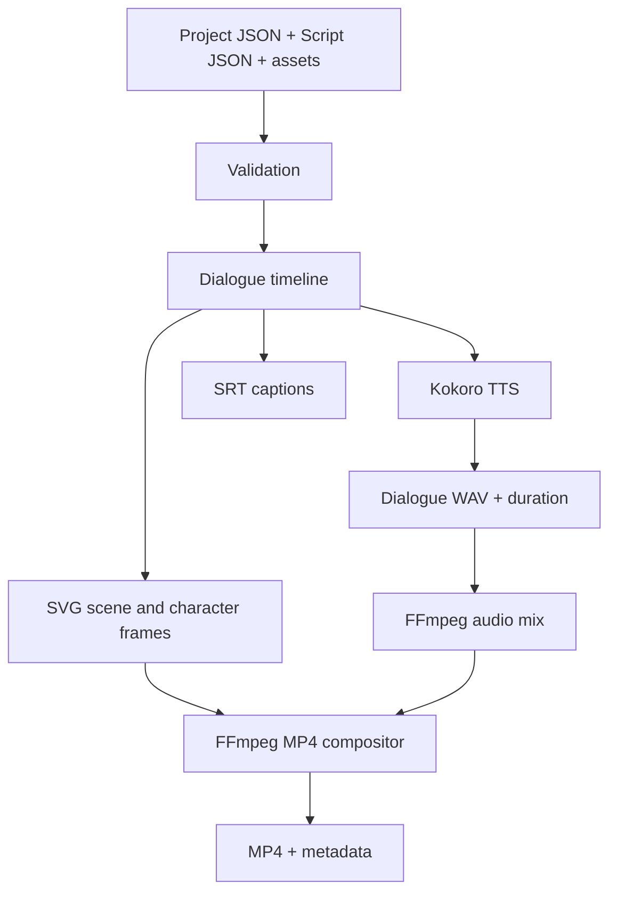

# AL Studio

AL Studio is a local-first, script-driven 2D animation studio. It renders reusable character and scene assets plus dialogue scripts into SVG frames, WAV audio, SRT captions, and an H.264/AAC MP4.

## Pipeline



See [LLD.md](LLD.md) for the detailed design.

## Prerequisites

- Linux, Python 3.12, FFmpeg, and eSpeak NG.
- Internet access for Kokoro's first model download; later synthesis uses the local cache.

Ubuntu/Linux Mint setup:

```bash
sudo apt update
sudo apt install ffmpeg espeak-ng python3.12 python3.12-venv
```

## Installation

```bash
python3.12 -m venv .venv
source .venv/bin/activate
python -m pip install --upgrade pip
pip install -e .
al-studio --help
```

## Quick Start

Validate the bundled project:

```bash
al-studio validate projects/starter-project/project.json
```

Render the 30-second example:

```bash
al-studio render projects/first-story/project.json projects/first-story/script.json --output output/first-story --verbose
```

The MP4 is written to `output/first-story/final/first-story.mp4`.

Use `--dry-run` to validate and record a render plan without creating media.

## CLI

```text
al-studio validate PROJECT [--assets ASSET_ROOT]
al-studio inspect-assets PROJECT [--assets ASSET_ROOT]
al-studio voice-preview --text TEXT --voice VOICE_ID [--output FILE.wav]
al-studio render PROJECT SCRIPT [--assets ASSET_ROOT] [--output DIRECTORY] [--dry-run] [--verbose]
```

For example, preview Alex's voice:

```bash
al-studio voice-preview --voice am_adam --text "Hello from AL Studio." --output output/alex.wav
```

## Project and Script Data

`project.json` defines versioned assets, characters, scenes, and render settings. Character voice IDs such as `am_adam` remain provider-neutral in project data. Asset paths are relative to `assets/` and cannot escape that root.

`script.json` defines scenes and timed events. Dialogue uses `speaker`, `text`, and an optional `caption`; its duration comes from generated audio. `action`, `ambience`, `sound_effect`, and `caption` events require `duration_seconds`.

See [projects/first-story/project.json](projects/first-story/project.json), [projects/first-story/script.json](projects/first-story/script.json), and [app/script/FORMAT.md](app/script/FORMAT.md) for complete examples.

## Output and Troubleshooting

Each render directory contains `metadata.json`, dialogue WAVs, SVG frames, `audio/mix.wav`, `subtitles/captions.srt`, and `final/<project>.mp4`. Retain it on failure: its intermediate artifacts and metadata show where the render stopped.

Run tests with:

```bash
.venv/bin/python -m pytest
```

See [TESTING.md](TESTING.md), [BENCHMARK.md](BENCHMARK.md), and [LICENSES.md](LICENSES.md) for development, performance, and license details.

## Current Limitations

This is an early deterministic vertical slice. Actions are timed but do not yet change poses; ambience and sound-effect events are parsed but not mixed from source assets; captions are SRT files rather than burned into MP4 video.
