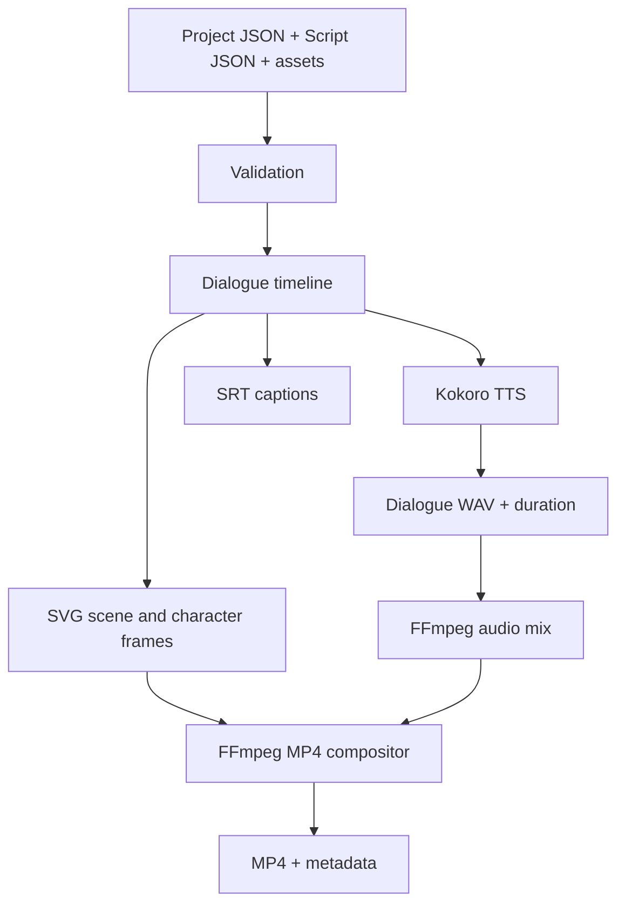

# AL Studio

AL Studio is a local-first, script-driven 2D animation studio. It renders reusable character and scene assets plus dialogue scripts into SVG frames, WAV audio, SRT captions, and an H.264/AAC MP4.

## Pipeline



See [LLD.md](LLD.md) for the detailed design.

## Prerequisites

- Linux, Python 3.12, FFmpeg, and eSpeak NG.
- Internet access for Kokoro's first model download; later synthesis uses the local cache.

Ubuntu/Linux Mint setup:

```bash
sudo apt update
sudo apt install ffmpeg espeak-ng python3.12 python3.12-venv
```

## Installation

Clone the repository and enter it:

```bash
git clone <your-fork-or-repository-url> al-studio
cd al-studio
```

Create an isolated Python environment. AL Studio currently supports Python
3.12 only because of its tested Kokoro dependency combination:

```bash
python3.12 -m venv .venv
source .venv/bin/activate
python -m pip install --upgrade pip
pip install -e .
```

The editable install means source edits are picked up immediately. Confirm the
command and system dependencies are available:

```bash
al-studio --help
ffmpeg -version
espeak-ng --version
```

On the first real speech synthesis, Kokoro downloads its model files to the
local Hugging Face cache. Keep the terminal connected to the internet for that
first run; future runs normally use the cache.

## Browser App

The **Al Studio** browser workspace provides the same local rendering pipeline
as the CLI through a guided visual interface. The CLI remains available for
automation and advanced workflows; both interfaces read the same projects and
assets and use the same render engine.

### Launch the Browser App

From the repository root, with the virtual environment active, run:

```bash
al-studio-web
```

Al Studio opens in your default browser at `http://127.0.0.1:8177`. Keep the
terminal running while using the app and press `Ctrl+C` to stop it. Always
launch from the repository root because that directory provides the local
`projects/`, `assets/`, and `output/` workspace.

### Create Your First Browser Project

1. Select **Projects** in the sidebar.
2. Select **New project**, enter a descriptive project name, and choose
   **Create project**.
3. The new project opens automatically and is also added to the **Current
   project** selector at the top of every workspace view.

Project creation writes `projects/<project-slug>/project.json` and
`projects/<project-slug>/script.json`. It also creates a valid opening scene,
a `Narrator` using the `af_heart` voice, and a neutral starter background, so
the new project can be edited, validated, and rendered immediately.

To resume existing work, select its card on **Projects** or choose it from the
**Current project** selector. Use **Refresh** if files were added or changed
outside the browser while the app was running.

### Import Assets in the Browser

1. Open **Assets**.
2. Choose a category: character image, scene background, prop image, sound
   effect, or music.
3. Choose a local file and select **Import asset**.

Visual categories accept SVG, PNG, and WebP. Audio categories accept WAV, MP3,
and OGG. Imports are limited to 50 MB, duplicate filenames are rejected, and
every destination is confined to the matching directory beneath `assets/`.
The asset library shows the stored relative path and file size after import.

Importing adds a reusable file to the library. Open **Scene** to place the
visual asset in the selected project's composition; audio assets remain
available to the underlying project format for future audio-track controls.

### Compose a Scene in the Browser

1. Select a project and open **Scene**.
2. Select the scene tab you want to edit.
3. Drag a character, prop, or scene image from the Asset Tray onto the stage.
4. Drag the placed object to move it. Drag its lower-right handle to resize it.
5. Use the Selection inspector for exact X/Y coordinates, width, height,
   rotation, opacity, visibility, and forward/backward layer ordering.
6. Choose **Save scene** to validate and write the layout to `project.json`.

The stage uses the same `1280 × 720` coordinate system as the renderer, so the
saved composition matches the generated frames. Each drop creates an
independent scene instance: the same reusable asset can be placed more than
once with different transforms. Older `prop_asset_ids` projects are converted
to explicit instances when their scene is edited and saved.

### Animate Objects in the Browser

1. Select a placed object on the **Scene** stage.
2. In **Animation**, choose a preset: fade in/out, slide in, bounce, float,
   pulse, rotate, or shake. Scene/background assets expose the applicable
   fade, slide, and pulse subset.
3. Set the delay and duration in seconds, direction, easing curve, and whether
   the motion loops. Choose **Add animation**.
4. Use **Preview scene animations** to play every animation in the selected
   scene together. Choose it again to stop the preview.
5. Edit or delete animation cards beneath the controls, then choose
   **Save scene**.

Animations are stored in the scene's `animations` array in `project.json`.
Each entry targets a scene-instance ID, so moving or resizing the object does
not detach its motion. The browser preview and SVG frame renderer use the same
deterministic preset equations and scene-local time; unchanged inputs render
the same result. Multiple animations can target one object and their position,
rotation, scale, and opacity effects are combined.

### Write a Story in the Browser

Open **Script** after selecting a project. The editor displays one tab for
each configured scene and one block for each event in the selected scene.

- A **Dialogue** block provides speaker, spoken text, and caption fields.
  Dialogue timing is calculated later from the generated voice audio.
- An **Action** block provides an action description and a positive duration.
- A **Caption** block provides on-screen text and a positive duration.
- **Ambience** and **Sound effect** blocks select a configured audio/music
  asset and provide a positive duration.

Every block has an optional **Start (seconds)** field. Leave it blank for the
original sequential behavior, where the block starts after the furthest prior
endpoint. Enter a value such as `0` or `1.5` to place it on scene-local time and
overlap it with animation, dialogue, captions, or audio. The four-lane
**Shared timeline** beneath the Scene composer visualizes the result. Dialogue
widths are planning estimates in the browser because the final duration comes
from the generated WAV; rendering replaces the estimate with measured timing.

Use the add buttons to create blocks. The `↑` and `↓` controls change event
order and `×` deletes a block. Choose **Save script** when finished; the server
validates timing plus scene, speaker, and audio-asset references before
replacing `script.json`. Audio/music imported while a project is open is
automatically registered with that project and becomes selectable in audio
blocks.

### Preview a Voice in the Browser

1. Open **Voice lab**.
2. Enter a Kokoro voice ID such as `af_heart` or `am_adam`.
3. Enter a short sample line and choose **Generate preview**.

The first preview may take longer while Kokoro initializes or downloads its
model. When synthesis completes, the WAV is loaded into the page's audio
player and a **Download WAV** link appears. Preview files are stored in
`output/web/previews/`.

### Validate and Render in the Browser

Open **Render** and use the controls in this order:

1. **Validate project** checks the project schema, script schema, scene and
   speaker references, supported asset types, and missing asset files.
2. **Run dry-run** executes preflight and writes metadata without loading TTS
   or creating final media.
3. **Render MP4** runs dialogue synthesis, frame rendering, audio mixing,
   caption writing, and MP4 composition.

The Current Job panel reports the active stage and percentage. Pipeline
failures appear in the same panel with their error message. Rendering runs as
a background job, so the browser remains responsive while the terminal-hosted
process does the work.

### Find Browser Rendered Output

Every browser job receives its own local directory:

```text
output/web/<project-slug>/<render-id>/
├── metadata.json
├── dialogue/*.wav
├── frames/*.svg
├── audio/mix.wav
├── subtitles/captions.srt
└── final/<project-name>.mp4
```

After completion, the Render view displays all supported artifacts. MP4 and
WAV files can be played in the page; MP4, WAV, SRT, and JSON metadata have
open/download links. Browser output and voice previews are Git-ignored.

### Browser Options, Security, and Troubleshooting

```bash
al-studio-web --no-browser       # start without opening a browser tab
al-studio-web --port 9123        # require a specific local port
```

The app binds only to `127.0.0.1`, so it is not exposed to other computers on
your network. If port 8177 is occupied, the default launcher tries ports
8178–8187 and prints the selected address. When using `--port`, the requested
port must be available.

If the page cannot connect, confirm the launcher terminal is still running
and open the exact address printed there. If validation fails, correct the
reported project, script, speaker, scene, or asset problem and run validation
again. If rendering fails, keep its output directory for diagnosis and review
the error shown in the Current Job panel.

## Where Your Files Go

The repository deliberately keeps private creative work out of Git:

```text
assets/                 Your local reusable images and audio (Git-ignored)
├── characters/
├── scenes/
├── props/
├── audio/
└── music/
projects/               Your local project and script JSON files (Git-ignored)
└── my-story/
    ├── project.json
    └── script.json
output/                 Generated media and render metadata (Git-ignored)
└── my-story/
```

`assets/`, `projects/`, and `output/` contain tracked `.gitkeep` placeholders
only. Put your actual images, audio, stories, and renders in the directories
above; they remain local unless you intentionally change the ignore rules.

## Create Your First Project

Create local directories for a project and its reusable visual assets:

```bash
mkdir -p assets/characters assets/scenes assets/props
mkdir -p projects/my-story
```

Add these three visual files:

```text
assets/characters/alex.svg
assets/scenes/room.svg
assets/props/plant.svg
```

The first renderer accepts `.svg`, `.png`, and `.webp` visual assets. SVG is a
good starting point because it stays crisp at any render size. Use a character
image that faces right; AL Studio can mirror it for left-facing states later.

Create `projects/my-story/project.json`:

```json
{
  "schema_version": 1,
  "name": "my-story",
  "assets": [
    {"id": "alex-visual", "kind": "character", "path": "characters/alex.svg"},
    {"id": "room", "kind": "scene", "path": "scenes/room.svg"},
    {"id": "plant", "kind": "prop", "path": "props/plant.svg"}
  ],
  "characters": [
    {
      "name": "Alex",
      "voice_id": "am_adam",
      "visual_asset_id": "alex-visual",
      "animation": {"idle_motion": true, "mouth_style": "simple"}
    }
  ],
  "scenes": [
    {
      "id": "room",
      "background_asset_id": "room",
      "instances": [
        {
          "id": "alex-left",
          "asset_id": "alex-visual",
          "x": 100,
          "y": 190,
          "width": 280,
          "height": 460,
          "rotation": 0,
          "opacity": 1,
          "z_index": 1,
          "visible": true
        },
        {
          "id": "plant-right",
          "asset_id": "plant",
          "x": 1020,
          "y": 430,
          "width": 140,
          "height": 205,
          "rotation": 0,
          "opacity": 1,
          "z_index": 2,
          "visible": true
        }
      ],
      "animations": [
        {
          "id": "alex-enter",
          "target": "alex-left",
          "preset": "slide-in",
          "start_seconds": 0,
          "duration_seconds": 1.2,
          "easing": "ease-out",
          "direction": "left",
          "loop": false
        }
      ],
      "camera": {"x": 0, "y": 0, "zoom": 1.0}
    }
  ],
  "render": {"width": 1280, "height": 720, "fps": 24}
}
```

Asset `path` values are always relative to `assets/`; paths cannot be absolute
or leave that directory. Valid asset kinds are `character`, `scene`, `prop`,
`audio`, and `music`.

Validate the project and inspect what AL Studio resolves before writing a
script:

```bash
al-studio validate projects/my-story/project.json
al-studio inspect-assets projects/my-story/project.json
```

## Write a Story Script

Create `projects/my-story/script.json`:

```json
{
  "schema_version": 1,
  "scenes": [
    {
      "scene_id": "room",
      "events": [
        {
          "type": "dialogue",
          "speaker": "Alex",
          "text": "Hello. This is my first story made with AL Studio.",
          "caption": "Hello. This is my first story made with AL Studio.",
          "start_seconds": 0
        },
        {"type": "action", "name": "wave", "start_seconds": 0, "duration_seconds": 0.8},
        {"type": "caption", "text": "The End", "start_seconds": 2.5, "duration_seconds": 1.5}
      ]
    }
  ]
}
```

`scene_id` must match a scene from `project.json`; `speaker` must match a
character name. Dialogue duration comes from the generated voice audio. The
other supported event types—`action`, `ambience`, `sound_effect`, and
`caption`—need a positive `duration_seconds`. `start_seconds` is optional and
must be zero or greater. Events with the same or intersecting time ranges run
in parallel; events without a start retain sequential, backwards-compatible
scheduling.

Actions are timeline markers rather than pose changes. Ambience and sound
effects reference `audio` or `music` assets from `project.json`; ambience loops
for its configured interval, sound effects are padded/trimmed to it, and both
are mixed with dialogue at their scheduled offsets. See
[app/script/FORMAT.md](app/script/FORMAT.md) for the formal format reference.

## Render Your Story

First run a dry run. It validates assets and project/script data without
calling TTS or producing media:

```bash
al-studio render \
  projects/my-story/project.json \
  projects/my-story/script.json \
  --output output/my-story-plan \
  --dry-run --verbose
```

Then render the complete story:

```bash
al-studio render \
  projects/my-story/project.json \
  projects/my-story/script.json \
  --output output/my-story \
  --verbose
```

`--verbose` prints the current stage order. A short CPU render can take longer
than the story duration because it includes voice synthesis and FFmpeg video
encoding.

## CLI

```text
al-studio validate PROJECT [--assets ASSET_ROOT]
al-studio inspect-assets PROJECT [--assets ASSET_ROOT]
al-studio voice-preview --text TEXT --voice VOICE_ID [--output FILE.wav]
al-studio render PROJECT SCRIPT [--assets ASSET_ROOT] [--output DIRECTORY]
                  [--dry-run] [--verbose]
```

Use `--assets` only when your reusable asset root is somewhere other than the
repository's `assets/` directory. Preview a voice before assigning it to a
character:

```bash
al-studio voice-preview \
  --voice am_adam \
  --text "Hello from AL Studio." \
  --output output/alex-preview.wav
```

## Find the Rendered Output

The example render above produces:

```text
output/my-story/
├── metadata.json                Render completion or dry-run state
├── dialogue/                    Generated character WAV files
├── frames/                      Deterministic SVG animation frames
├── audio/mix.wav                Final mixed dialogue audio
├── subtitles/captions.srt       Time-aligned subtitles
└── final/my-story.mp4           Final H.264/AAC video
```

Open `final/my-story.mp4` in your normal media player. Keep the whole output
directory if a render fails: `metadata.json`, the dialogue WAVs, frames, and
mix identify which stage completed. Fix the reported project, script, asset,
or TTS issue and rerun the same command.

## Tests and Development

Run tests with:

```bash
.venv/bin/python -m pytest -q
```

For source checks in a development environment, install `ruff` and `mypy`,
then run:

```bash
ruff format --check app tests
ruff check app tests
mypy app
```

## Current Limitations

This is an early deterministic vertical slice. Actions are timed but do not yet change poses; ambience and sound-effect events are parsed but not mixed from source assets; captions are SRT files rather than burned into MP4 video.
